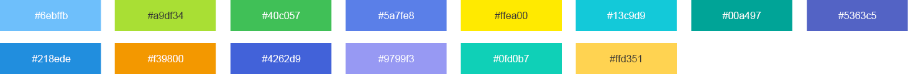
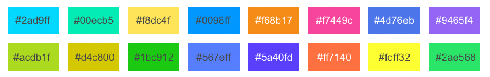

# 颜色说明

#### 白底配色
图表默认使用配色如下：

	'#6ebffb', '#a9df34', '#40c057', '#5a7fe8', '#ffea00', '#13c9d9', '#00a497', '#5363c5', '#218ede', '#f39800', '#4262d9', '#9799f3', '#0fd0b7', '#ffd351'
    

#### 深色底配色
图表默认使用配色如下：

	'#2ad9ff', '#00ecb5', '#f8dc4f', '#0098ff', '#f68b17', '#f7449c', '#4d76eb', '#9465f4', '#acdb1f', '#d4c800', '#1bc912', '#567eff', '#5a40fd', '#ff7140', '#fdff32', '#2ae568'
    
    

    
#### 水质Ⅰ~ 劣Ⅴ类配色 
配置项config.color中可简写作: 'waterGradesColor'

    '#44c5fd', 51a5fd', '#73bb31', '#eebd15', '#f88e17', '#ee3b5b'
 
#### 合并1，2类的水质级别颜色 
配置项config.color中可简写作: 'merge1n2WaterGradesColor'

    '#44c5fd', '#73bb31', '#eebd15', '#f88e17', '#ee3b5b'
    
#### 富营养状态等级颜色 
配置项config.color中可简写作: 'eutrophicationColor'

    '#44c5fd', '#73bb31', '#eebd15', '#f88e17', '#ee3b5b'
 
#### 空气质量 优 ~ 严重污染颜色 
配置项config.color中可简写作: 'airGradesColor'

    '#24bd5d', '#d8bc37', '#f87c12', '#f60000', '#94004b', '#6f001f'
 
#### 渐变色示例
`{
	x: 0,
	y: 0,
	x2: 0,
	y2: 1,
	type: 'linear',
	global: false,
	colorStops: [
		{
			offset: 0,
			color: 'rgba(10,219,250,0.5)'
		},
		{
			offset: 1,
			color: 'rgba(10,219,250, 0)'
		}
	]
}`
 
