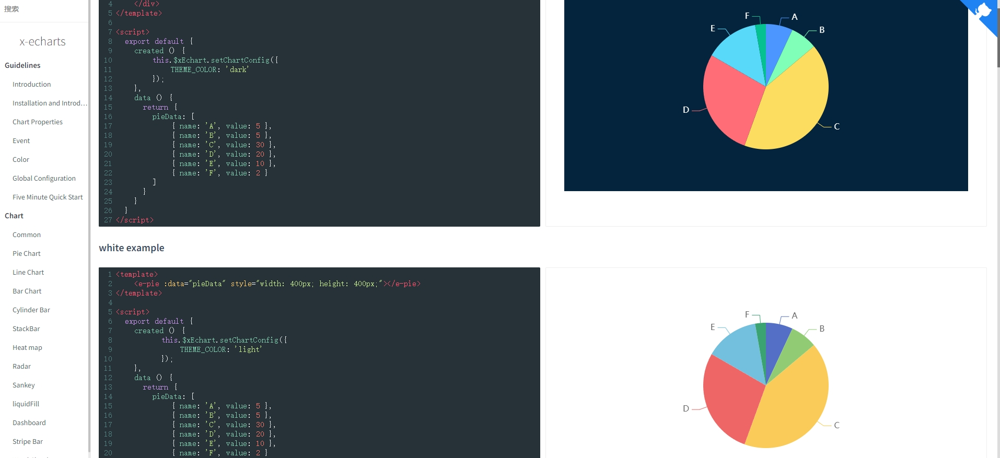
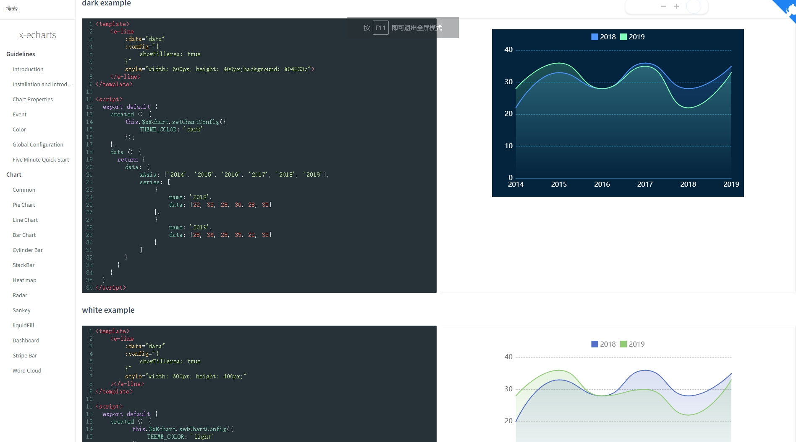
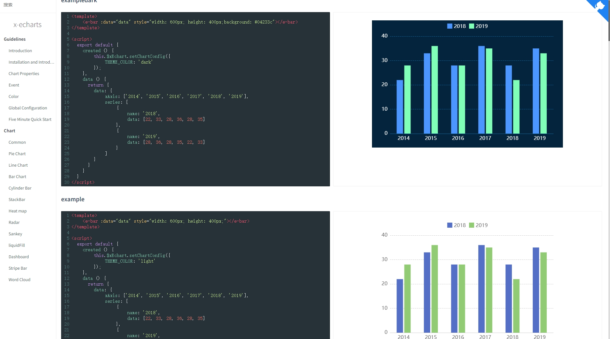

# x-echarts
基于echarts封装的vue组件，支持vue2，vue3，只需要统一提供一种对前后端都友好的数据格式设置简单的配置项，便可轻松生成常见的图表

Based on the echarts-wrapped vue component, it supports vue2 and vue3. Simply provide a unified data format that is friendly to both the front-end and back-end, and you can easily generate common charts with simple configuration items.

[English Docs](http://121.43.33.102/docsEn/#/) | [中文文档](http://121.43.33.102/docs/#/) 

如果觉得工具好用，请给我的github点一个赞  [传送门](https://github.com/eagle1949/x-echarts)

If you think the tool is useful, please give me a thumbs up on Github

[click here give me a star](https://github.com/eagle1949/x-echarts)

